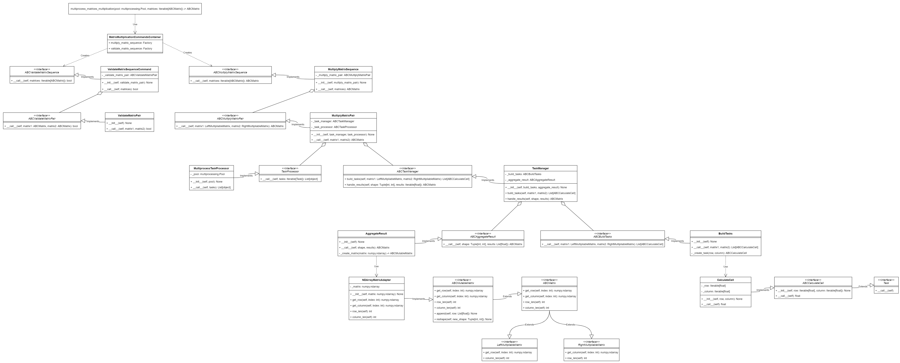

# Initialization
## Clone project
```
git clone https://github.com/yari61/otus-patterns-multiprocess.git
cd otus-patterns-multiprocess
```

## Virtual environment
It is recommended to create a virtual environment at first
```
python -m venv <virtual_env_name (.venv for example)>
```

Then activate it with 
- ```source <virtual_env_name>/bin/activate```
on Unix-like systems, or
- ```<virtual_env_name>\bin\activate```
if Your system runs Windows

## Installation
To install the package run the next command in your virtual environment
```
pip install -e .
```

## Testing
To run tests execute this
```
python -m unittest
```

# Project structure
## Class diagram

